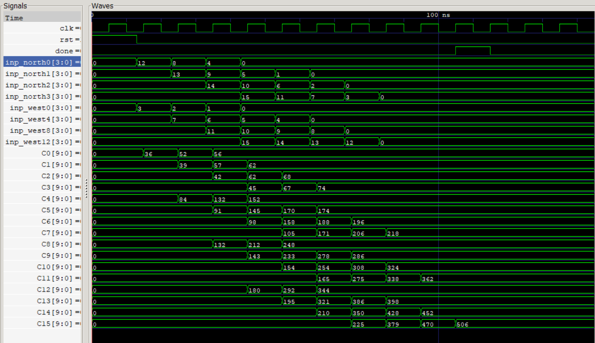
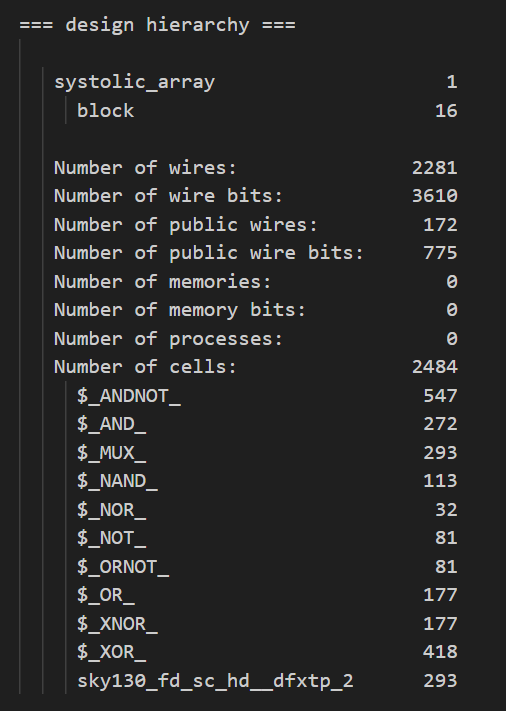
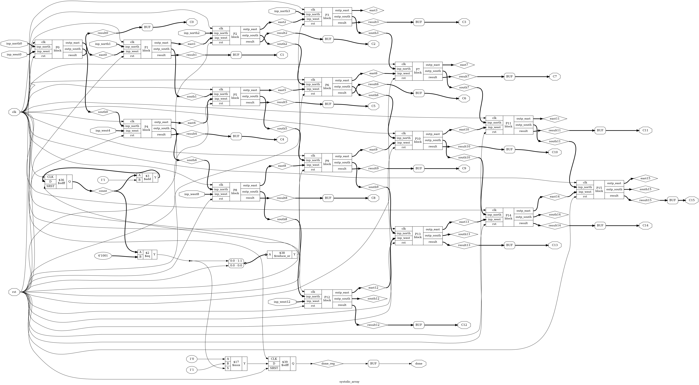
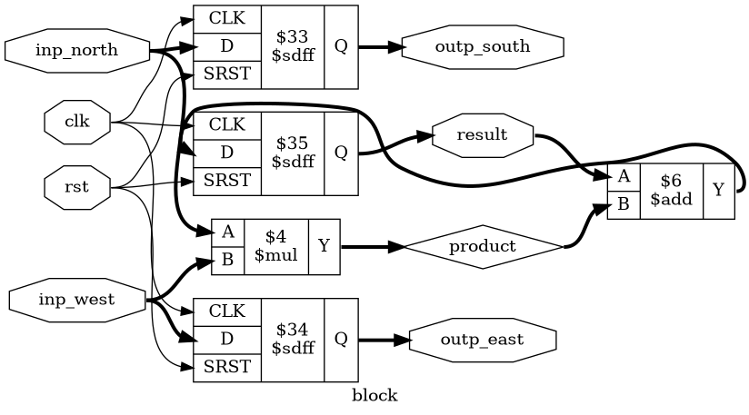
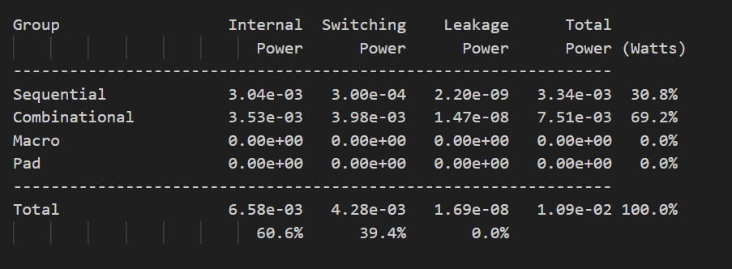
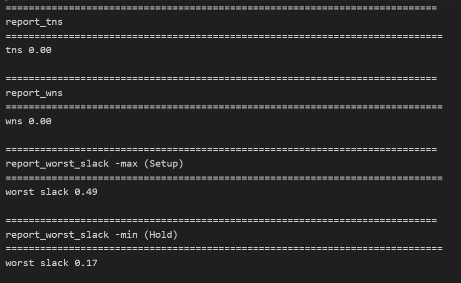
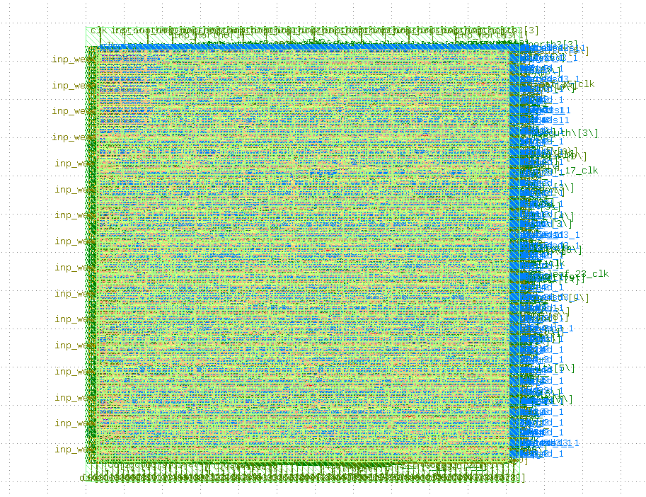

# 🚀 RTL-to-GDSII Design Flow: Systolic Array Processor

This repository contains the complete Physical Design implementation of a **Systolic Array** (optimized for Matrix Multiplication) using the **OpenLane** flow and the **SkyWater 130nm** PDK.

The project transforms a Verilog RTL description into a fabrication-ready GDSII file while optimizing for Power, Performance, and Area (PPA).

---

## 🛠 Tools & Methodology
* **RTL & Verification:** Verilog HDL, Icarus Verilog, GTKWave
* **Physical Design:** OpenLane Flow (Yosys, OpenSTA, TritonCTS, Magic, Netgen)
* **PDK:** SkyWater 130nm (`sky130_fd_sc_hd`)
* **OS:** Linux [WSL2 (Ubuntu)]
---

## 🔄 The RTL-to-GDSII Flow

This project follows the **OpenLane** automated synthesis and physical design flow, transforming high-level Verilog into a fabrication-ready layout.

1. **RTL (Register Transfer Level):** The design begins with hardware description in Verilog, defining the Systolic Array logic and Processing Elements.
2. **Functional Verification:** Running testbenches via `Icarus Verilog` to ensure the $4 \times 4$ matrix multiplication logic is cycle-accurate.
3. **Synthesis:** `Yosys` maps the RTL to the **SkyWater 130nm** standard cell library, generating a gate-level netlist.
4. **Floorplanning:** Defining the core area, aspect ratio ($1.0$), and strategic placement of I/O pins for optimal data flow.
5. **Placement:** `RePlace` and `OpenDP` perform global and detailed placement of standard cells to minimize wire length.
6. **CTS (Clock Tree Synthesis):** `TritonCTS` builds the clock distribution network, ensuring minimal clock skew and latency across the 16 PEs.
7. **Routing:** `FastRoute` and `TritonRoute` handle global and detailed routing, connecting all logic gates while avoiding congestion.
8. **Sign-off:** Final physical verification using `Magic` (DRC) and `Netgen` (LVS) to ensure the design is error-free before GDSII generation.

---
---

## 📂 Phase 1: RTL Design & Architecture

A high-performance **Verilog-based hardware accelerator** for 32-bit integer matrix multiplication. This design leverages a **spatially pipelined architecture** to achieve high-throughput parallel computation, optimized for DSP and AI/ML workloads.

---

## 🧠 Architecture Overview
    

This design utilizes a **2D 4×4 grid** of 16 synchronized Processing Elements (PEs). Unlike conventional multipliers, data pulses rhythmically through the array, reducing global routing and power consumption.

* **PE Logic:** Each unit contains a clocked **MAC** (Multiply-Accumulate) unit with a 4-bit accumulator.
* **Dataflow:** Operands propagate **Right** (Matrix A) and **Down** (Matrix B) every clock cycle.
* **Pipelining:** Fully registered outputs enable concurrent computation across all 16 PEs.

---

## 🛠️ Technical Specifications

| Feature | Details |
| :--- | :--- |
| **Precision** | 4-bit Signed Integers |
| **Array Size** | 4 × 4 (16 MAC Units) |
| **Hierarchy** | `PE` → `Row` → `Top_Array` |
| **Tools** | Icarus Verilog, GTKWave, VS Code |

---

## ✅ Key Features

* **Massive Parallelism:** Executes 16 MAC operations simultaneously.
* **Local Data Reuse:** Minimizes memory bandwidth by passing operands directly to neighbors.
* **Modular RTL:** Clean, hierarchical design allows for easy scaling to $N \times N$ arrays.
* **Timing Optimized:** Output-pipelined registers ensure high-frequency operation.

---
---

## 🧪 Phase 2: Functional Verification

The systolic array was verified using a testbench to ensure the rhythmic flow of data through the Processing Elements (PEs).
The design uses a staggered input testbench to account for the systolic "wave" delay, ensuring that the correct row/column elements meet at the designated PE at the exact clock cycle.

*Figure 1: GTKWave functional simulation confirming matrix multiplication accuracy.*

---
---

## ⚙️ Phase 3: Logic Synthesis

The RTL was synthesized into a gate-level netlist using **Yosys**.

### Synthesis Statistics

---

### Logic Schematics

*Figure 2: Yosys Synthesis Schematic - Top Level Block*

*Figure 3: Yosys Synthesis Schematic - Systolic Array Sub-module*

---
---

## 🔄 Phase 4: OpenLane Physical Design Flow

The physical implementation follows the automated OpenLane stages to optimize PPA.

1. **Floorplanning:** Defined core area and aspect ratio ($1.0$).
2. **Placement:** Global and detailed placement clustered PEs to minimize wire length.
3. **CTS (Clock Tree Synthesis):** Built a balanced clock tree to minimize skew across all 16 PEs.
4. **Routing:** Global and detailed routing of all signal nets.
5. **Sign-off:** DRC (Magic) and LVS (Netgen) checks ensured the layout matches the netlist exactly.

---

## Optimized Run

**Key Configurations:**
* CLOCK_PERIOD : 3.7ns
* FP_CORE_UTIL: 70%
* PL_TARGET_DENSITY: 0.75
* SYNTH_STRATEGY: "DELAY 3"
* MAX_FANOUT_CONSTRAINT: 5 

**Key Output Parameters:**

1) **Power Report**
   
   
  
2) **Core Area:** 46358 µm²
3) **Cell count:** 7720
4) **Timing Report**
   

---
---

## 💡 Phase 5: Optimization & Final Results

1) **Clk Period:** With a **Worst Setup Slack of X ns**, the design is timing-clean but conservative. This implies the clock period ($T_{clk}$) can be reduced by X ns to reach the maximum frequency of the design.
    > $T_{min} = T_{clk} - X ns$
2) **Synthesis Strategy:** Since systolic array is an accelerator our main priority is its performance so we change the synthesis strategy from AREA to DELAY.
3) **Core Utilization & PL Target density:** By increasing these, All the cells are densely packed so better timing, and power reduction due to smaller nets.

----

## 📈 Optimization Stages
We iterated through 7 optimization steps by tuning `config.json` to find the optimal PPA balance.

| Step | Key Change in `config.json` | Core Area ($µm²$) | Cells | Setup Slack ($ns$) | Power | Result |
| :--- | :--- | :--- | :--- | :--- | :--- | :--- |
| **1** | **$T_{clk}$ = 10ns** `CORE_UTIL`: 40 `PL_TAREGET_DENSITY` : 0.45 `SYNTH_STRATEGY`: "AREA 3" | 83555.14 | 14680 | 5.11 | 3.84mW |Baseline run |
| **2** | **$T_{clk}$ = 10ns** `CORE_UTIL`: 40 `PL_TAREGET_DENSITY` : 0.45 `SYNTH_STRATEGY`: "DELAY 3" | 81584.5 | 12738 | 5.21 | 4.13mW | Slack improved slightly at power trade-off |
| **3** | **$T_{clk}$ = 10ns** `CORE_UTIL`: 70 `PL_TAREGET_DENSITY` : 0.75 `SYNTH_STRATEGY`: "DELAY 3" | 46358.21 | 7719 | 5.69 | 3.97mW | Area & cells reduced significantly |
| **4** | **$T_{clk}$ = 5ns** `CORE_UTIL`: 70 `PL_TAREGET_DENSITY` : 0.75 `SYNTH_STRATEGY`: "DELAY 3"| 46358.21 | 7695 | 1.63 | 8.13mW | Performace doubled, performace-power trade-off |
| **5** | **$T_{clk}$ = 3.7ns** `CORE_UTIL`: 70 `PL_TAREGET_DENSITY` : 0.75 `SYNTH_STRATEGY`: "DELAY 3" | 46358.21 | 7720 | 0.49 | 10.9mW | Performace increased by another 35% |
| **6** | **$T_{clk}$ = 3.2ns** `CORE_UTIL`: 70 `PL_TAREGET_DENSITY` : 0.75 `SYNTH_STRATEGY`: "DELAY 3" | 46358.21 | 7611 | 0.07 | 12.7mW | performance increased by 15% but power also increased by 20% |
| **7** | **$T_{clk}$ = 3.5ns** `CORE_UTIL`: 70 `PL_TAREGET_DENSITY` : 0.75 `SYNTH_STRATEGY`: "DELAY 3" `CTS_SINK_CLUSTERING_SIZE`: 10 `SYNTH_NO_FANOUT_LIMIT`: 0 `MAX_FANOUT_CONSTRAINT`: 8 | 45088.24 | 6839 | 0.23 | 12.6mW | have only 5 fanout violations |
| **8** | **$T_{clk}$ = 3.5ns** `CORE_UTIL`: 80 `PL_TAREGET_DENSITY` : 0.85 `SYNTH_STRATEGY`: "DELAY 3"| - | - | - | - | Detailed placement failed |

**Final Decision:** **Step 5** was selected as it provides the highest clock frequency (lowest $T_{clk}$) while maintaining a safe positive slack and optimized area with no slew violations.

---

## 💡 Post-Layout Optimization Analysis

By iterating through 7 configurations, we achieved a significant performance boost over the baseline OpenLane settings.

* **Frequency Scaling:** By reducing the clock period from the baseline to **3.7ns**, we achieved a stable operating frequency of **270.27 MHz**. 
* **Timing Closure:** With a **Worst Setup Slack of 0.49ns**, the design is timing-clean. This positive slack indicates that the design is robust against PVT (Process, Voltage, Temperature) variations.
* **Density vs. Timing:** Increasing `PL_TARGET_DENSITY` to **0.75** forced the placer to cluster PEs more tightly, which reduced the wire length of the critical paths and lowered overall switching power.

---
---

### 📊 Final Sign-off Metrics (Step 5)

| Metric | Details / Value |
| :--- | :--- |
| **Technology Node** | SkyWater 130nm (`sky130_fd_sc_hd`) |
| **Clock Period ($T_{clk}$)** | 3.7 ns |
| **Max Operating Frequency** | ~270.27 MHz |
| **Setup Slack** | +0.49 ns (Timing Clean) |
| **Hold Slack** | +0.17 ns (Timing Clean) |
| **Total Power** | 10.9 mW |
| **Total Core Area** | 46,358 µm² |
| **Cell Count** | 7,720 |
| **Core Utilization** | 70% |
| **Physical Verification** | DRC: 0 / LVS: 0 (Passed) |

---
---

## 💎 Final GDSII Layout
The optimized GDSII file generated after Step 5, verified for DRC/LVS.

*Figure 4: Final GDSII Layout for the Optimized Systolic Array.*

---

## Challenges Faced During the Project

### 1. Over-Optimization During Synthesis
Initially, while synthesizing the systolic array using **Yosys**, the tool optimized away all 16 Processing Elements (PEs) because their computed results were not connected to any observable top-level output ports. As a result, only the control/counter logic responsible for generating the `done` signal was retained after synthesis.

### Resolution
To ensure the datapath was preserved, the PE result signals were exposed through top-level output ports / marked with preservation attributes so that Yosys treated them as observable logic and prevented aggressive optimization.

### 2. Floorplanning Issues in Small Designs
During the implementation of smaller designs, the physical design flow initially failed because the automatically generated core area was too small. This occurred because the default **core utilization** was set to **50%**, and for small designs this resulted in a compact core area that could not accommodate the **Power Distribution Network (PDN)**, which requires a minimum fixed amount of routing/placement space.

### Resolution
The issue was analyzed and traced to the default floorplanning parameters. Core area/utilization settings were adjusted manually for smaller designs to provide sufficient space for PDN generation. This issue was not observed in larger designs, as their core area remained sufficiently large even with the same utilization percentage.

### 3. Max Fanout Violations During Clock Tree Synthesis
During physical design, the clock tree initially exhibited significant **maximum fanout violations**, where several clock buffer branches were driving more loads than the specified fanout constraint allowed. This occurred because the synthesized clock tree had densely distributed sink connections, causing certain clock buffer nodes to become overloaded and violate the maximum fanout limits.

### Resolution
The issue was addressed by iteratively tuning the **Clock Tree Synthesis (CTS)** and floorplanning parameters. Maximum fanout constraints were relaxed to realistic values, stronger clock buffer cells were enabled, and CTS sink clustering parameters were adjusted to improve clock tree branching. These optimizations significantly reduced the severity and count of max fanout violations.

